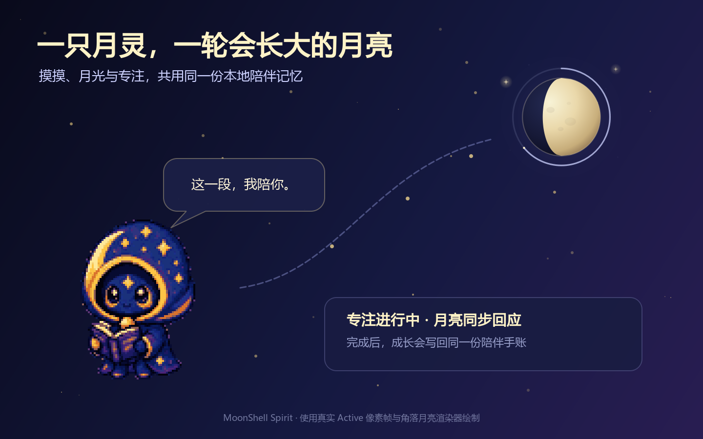

# 月壳游灵 · MoonShell Spirit

一只完全本地、会记住共同生活痕迹的 Windows 像素月灵。它会在桌面上散步、
犯困、回应摸摸，也会在你工作时安静陪伴。每日互动与完成的专注汇入同一份
陪伴记忆：桌面角落的月亮随之生长，手账则把这些变化留存下来。

<p align="center">
  
  <br>
  <sub>体验构成预览：角色使用真实 Active 像素帧并按整数倍放大，月亮使用运行时渲染器；不是操作系统桌面截图。</sub>
</p>

## 核心体验

`桌面月灵陪伴 → 完成专注或领取每日月光 → 角落月亮回应并生长 → 同一份记录进入陪伴手账`

- 月灵负责近距离陪伴：摸摸、拖动、散步、休息，以及少量有原因的表情反馈。
- 专注与每日互动不是独立计数器。完成记录和月光共同影响同一轮角落月亮；
  真实月相决定它的受光形状，长期陪伴决定它的尺寸、光晕与星图。
- 陪伴手账与今日卡片读取同一份本地记录，不设置连续打卡，也不因离开而惩罚。

## 现在能做什么

- 点击摸头、拖动搬家、抛接弹跳、散步、犯困和屏幕边缘探头。
- 精力、心情、好奇、困意和注意力会缓慢变化，并跨重启延续。
- 25 / 50 / 90 分钟专注陪伴，期间只保留安静动作，重启后可继续倒计时；
  完成的段数与分钟会写进陪伴手账，取消不会算作失败。
- 每个自然日可通过第一次摸摸或托盘菜单领取一枚月光；每七枚会出现一次
  星晶里程碑，没有连续签到和断签惩罚。
- 桌面角落的月亮把真实月相、已有月光和累计专注收在一个对象里；专注期间只显示
  克制的进度反馈，完成或领取月光时短暂回应。
- 陪伴手账会展示相识天数、月光、星晶、今日与累计专注；它只记录共同生活，
  不制造连续打卡压力。
- 手账可以把当天月相、角色与陪伴数据生成一张 1080×1080 PNG“今日月灵卡片”；
  图片完全在本机绘制，MoonShell 不主动上传；保存目录是否同步由系统设置决定。
- 根据真实月相做完全离线的八相展示；接近新月、上弦、满月或下弦时，
  月灵偶尔会说一句应景的话。不读取定位，也不请求天气或网络。
- 可选感知 CPU、内存、电量和最后输入间隔；系统提供 NVIDIA `nvidia-smi`
  时也会尽力读取 GPU 与显存占用。持续高负载时会温和提醒，并减少高活跃动作。
- 托盘可调整活跃度、尺寸、置顶和隐私开关，并能随时把月灵唤回主屏幕。
- 单实例、混合 DPI 多屏定位、托盘异常时自动唤回或安全退出、原子存档和
  本地滚动日志。

## 下载与运行

发布包支持 **Windows 10 1809 或更高版本 / Windows 11，x64**。

1. 从 [GitHub Releases](https://github.com/Master-Norna/Moonshell/releases)
   下载 `MoonShell-<版本>-windows-x64-portable.zip`。
2. 校验同一发布页中的 `SHA256SUMS.txt`。
3. 完整解压 ZIP，双击 `MoonShell.exe`。不要只把 EXE 单独移出目录。

当前 GitHub 便携维护包没有 Authenticode 代码签名，Windows 首次运行时可能
显示“未知发布者”或 SmartScreen 提示。请只从本项目的 GitHub Releases
下载；如果无法确认来源，请不要运行。可用 PowerShell 核对下载内容：

```powershell
Get-FileHash `
  .\MoonShell-<版本>-windows-x64-portable.zip `
  -Algorithm SHA256
```

结果应与同一发布页的 `SHA256SUMS.txt` 完全一致。SHA-256 只能确认文件内容
没有在下载过程中发生变化，不等同于发布者代码签名。

单击月灵可以摸摸它，按住可以拖动；右键月灵或托盘图标打开菜单。
Alt+F4 会在托盘可用时暂时隐藏，单击托盘图标即可唤回。若系统托盘不可用，
关闭窗口会直接退出，不会留下无入口的后台进程。

## 使用与隐私

托盘菜单中的“使用与隐私 · 关于”提供键盘和读屏可访问的完整说明，
也可以打开数据目录或清除全部本地数据。

- 键盘可按 Win+B 进入通知区域，用方向键选中 MoonShell，再按 Shift+F10
  （或菜单键）打开托盘菜单。
- “显示桌面月灵（重启后保持）”会记住显示偏好，但不包含开机自启；临时隐藏
  仍会继续专注计时，退出期间不会提醒，截止前重新启动可继续。
- 核心陪伴完全本地运行；除非主动点击“项目主页与反馈”交给浏览器打开，
  MoonShell 不主动联网，也不上传数据。
- “回应复制动作”默认关闭；开启后只判断剪贴板是否声明为文本类型，
  不读取、不保存剪贴板正文。
- 设备感知默认开启并可以关闭；桌宠隐藏后会停止设备采样和复制回应。
- 设置、陪伴记忆、月光、专注手账和诊断日志保存在
  `%LOCALAPPDATA%\MoonShell\`。
- 从 1.0 以前版本升级时，会在单实例锁内把
  `~/.desktop_pet_mvp/` 中有效的 JSON 数据原子迁移一次；旧文件保留，
  直到用户在应用内选择清除全部本地数据。

## 从源码运行

需要 64 位 Python 3.11 或更高版本。

```powershell
# 双击也可以；首次运行会建立 .venv 并安装依赖
.\start.cmd
```

或手动运行：

```powershell
python -m venv .venv
.\.venv\Scripts\python -m pip install -r requirements.txt
.\.venv\Scripts\python main.py
```

## 开发与验收

```powershell
.\start.ps1 -Check

# 或逐项运行
.\.venv\Scripts\python -m unittest discover -s tests -v
.\.venv\Scripts\python tools\check_sprites.py
.\.venv\Scripts\python tools\check_layout.py
.\.venv\Scripts\python tools\check_release.py
```

构建隔离的 Windows 便携发布包：

```powershell
powershell.exe -NoProfile -ExecutionPolicy Bypass -File .\build-release.ps1
```

脚本会创建独立的 `.build-venv`，使用锁定依赖，完成测试、PyInstaller
onedir 构建、PE/资源/许可证检查、原生 Windows 平台冒烟，再在 `dist\`
生成 ZIP 和 SHA-256 清单。冻结程序的冒烟数据放在临时目录，不会触碰真实
用户存档。

GitHub 手动运行发布流水线只生成未签名 QA artifact，不会公开发布。
`v<版本>` tag push 必须精确匹配应用版本、指向已进入 `origin/main` 的提交，
并通过全部构建与验收后才会发布明确标注未签名的维护包。普通构建任务只有
只读权限；独立发布任务才有 `contents: write`，且发布前会再次核对远端 tag、
main 历史和 ZIP 的 SHA-256，避免远端引用变化造成源码与附件错配。

## 美术管线

- `assets/_masters/` 是 96×96 平滑母版工作源。
- `assets/moonshell/` 保存 24 色、二值 Alpha 像素帧；运行时只加载视觉 allowlist。
- [`docs/VISUAL_LANGUAGE.md`](docs/VISUAL_LANGUAGE.md) 规定唯一 canonical、
  Active / Paused / Redo 分组、整数缩放和 README 使用边界。
- `docs/runtime-preview-v2.png` 由真实 Active 帧与 `MoonRenderer` 离线绘制，
  用于说明二者联动；它是体验构成预览，不冒充操作系统截图。
- `docs/v2_character_anchor.png` 由原始生成稿移除棋盘底后，以 Active 共享 24 色和
  4× 最近邻网格像素化；它仍只是视觉方向板，不是可上线精灵。
- `python tools/pixelize.py --apply` 按 active 资源重建共享色板，不让暂停素材影响角色颜色。
- `python tools/pixelize_reference_board.py --apply` 将生成的方向板也纳入同一像素约束。
- `python tools/build_icon.py` 从角色可见区域生成八档 Windows ICO。
- `python tools/render_experience_preview.py` 用真实 Active 帧和月亮渲染器重建 README 首图；
  `python tools/render_daily_card_preview.py` 通过真实卡片代码重建日卡预览。
- `python tools/build_qt_notices.py <QtBase 6.11.1 源码目录>` 从官方归属元数据
  重建离线 Qt NOTICE 与 SPDX 清单，并记录 Qt 软件渲染兜底、翻译和
  Qt for Python 的精确来源；源码 URL 和 SHA-256 均写入生成文件。
- 详细约束见 [assets/_masters/README.md](assets/_masters/README.md)。

新增或重做角色帧必须先通过视觉规范和 active 联系表复核；Paused / Redo 素材
不得进入运行时随机池、共享调色板输入或 README 用户预览。

## 项目结构

```text
main.py                 应用入口、单实例守护和发布冒烟钩子
pet/                    窗口、行为、监控、设置、状态、路径和日志
assets/moonshell/       像素角色帧（启用集合由 sprite_config 控制）
assets/_masters/        像素化前的母版工作源
assets/branding/        多尺寸 Windows 图标
docs/                   用户预览与视觉语言规范
tools/                  美术、测试、构建和发布校验工具
tests/                  单元与窗口交互测试
packaging/              Windows 版本资源
MoonShell.spec          PyInstaller onedir 规范
```

## 许可证

MoonShell 源码使用 [MIT License](LICENSE)。发布包中的 CPython、Qt /
PySide6、psutil 和 PyInstaller bootloader 适用各自许可证；详见
[THIRD_PARTY_NOTICES.md](THIRD_PARTY_NOTICES.md) 和 `LICENSES/`。
