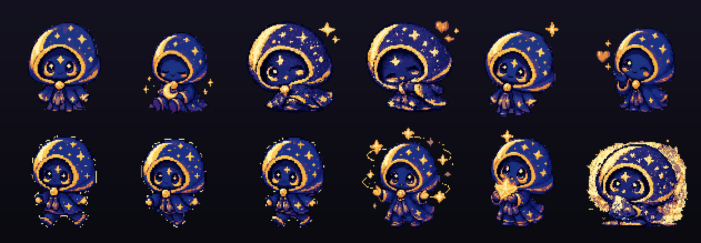

# 月壳游灵 · MoonShell Spirit

一只裹着星空斗篷的像素小月灵,住在你的 Windows 桌面上 —— 一个用 **PySide6** 写的悬浮桌宠。
它不是一张会动的贴图,而是有自己"内心天气"的小伙伴:会困、会好奇、会因为你的机器忙起来而紧张,
会记得你离开了多久,夜里会犯困、白天会精神。



## 特性

**形象与渲染**
- 96×96 像素角色,放进 144×144 透明"安全舞台",头顶/动作永不被窗口裁切
- 真像素风:平滑母版经 **24 色共享调色板**量化上色,全 43 帧统一不漂色
- 43 帧动作:idle / blink / 表情(happy/shy/pout/sad/excited/love/surprised/wink/yawn…)、
  特效(magic/flame/twirl/moon/star/crystal/poof/teleport)、读写、以及 **4 帧走路循环**
- 紧凑(1×,像素级清晰)/ 标准(2×)两档尺寸

**像活物一样的行为**
- 情绪系统(精力 / 心情 / 好奇 / 困意 / 注意力)驱动所有动作,且跨重启延续(记得你离开多久)
- 感知 CPU / GPU / 内存 / 电量 / 你的空闲时长,机器忙了会紧张、久坐会提醒伸懒腰
- 昼夜节律:夜里犯困打哈欠、骑月亮,清晨问好 —— 夜间专属行为不会在白天乱触发
- 拖拽抛接(带重力 / 弹跳 / 甩晕)、摸头互动(连摸会升级反应)、光标靠近转头看你、走到屏幕边缘探头
- 托盘菜单:启用 / 置顶 / 活动强度 / 尺寸 / 重置位置;单实例守护;多屏 & DPI 自适应

## 运行

需要 Windows + Python 3.11+。

```powershell
# 双击 start.cmd 即可(首次自动建 venv 装依赖,之后秒开)
.\start.cmd
```

或手动:

```powershell
python -m venv .venv
.\.venv\Scripts\pip install -r requirements.txt
.\.venv\Scripts\python main.py
```

右键托盘图标里有全部开关,退出也在托盘菜单。

## 开发

```powershell
.\.venv\Scripts\python -m unittest discover -s tests   # 21 个测试
.\.venv\Scripts\python tools\check_sprites.py          # 校验所有帧为 96×96 / 干净 alpha
```

### 美术管线(如何换 / 加角色帧)
- `assets/_masters/` 是每帧的 96×96 平滑母版(工作源);`assets/moonshell/` 的 24 色像素版由它生成
- 改色数 / 加帧后,跑 `python tools\pixelize.py --apply` 用整套母版统一重建像素图(共享调色板)
- 流程细节见 [assets/_masters/README.md](assets/_masters/README.md)

## 项目结构

```
main.py              入口 + 单实例守护
pet/                 桌宠核心(窗口 / 渲染 / 行为大脑 / 系统监控 / 设置 / 状态)
tools/               美术管线(切图 / 校验 / 像素化)
tests/               单元测试
assets/moonshell/    上线的 43 帧像素图
assets/_masters/     像素化前的平滑母版(工作源)
docs/                预览图
```

## 许可证

以 MIT 许可证开源,见 [LICENSE](LICENSE)。
